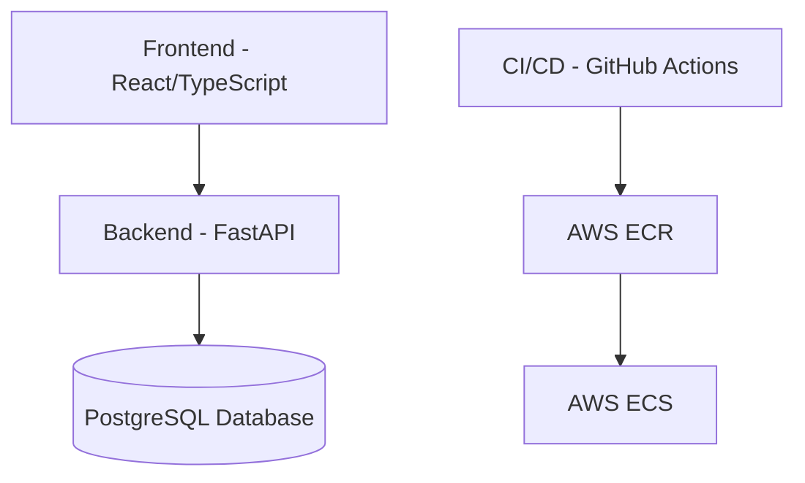
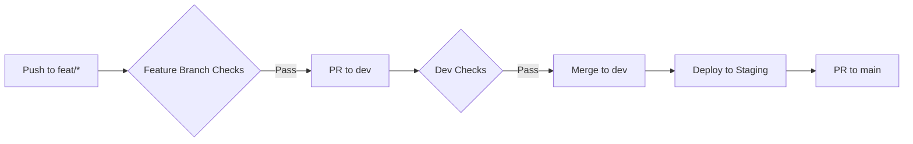

# 🚀 DevOps Demo Application

    

This repository contains a modern full-stack application with a FastAPI backend and React frontend, featuring a comprehensive CI/CD pipeline for AWS deployment.

## 📋 Table of Contents

- [Architecture Overview](#-architecture-overview)
- [Development Environment Setup](#-development-environment-setup)
- [Docker-based Development](#-docker-based-development)
- [Local Development](#-local-development)
- [Development Workflow](#-development-workflow)
- [CI/CD Pipeline](#-cicd-pipeline)
- [Documentation](#-documentation)
- [Environment Configuration](#-environment-configuration)
- [Testing](#-testing)
- [Troubleshooting](#-troubleshooting)

## 🏗️ Architecture Overview



- **Frontend**: React, TypeScript, TanStack Query, Chakra UI
- **Backend**: FastAPI, SQLModel, Pydantic
- **Database**: PostgreSQL
- **Infrastructure**: Docker, AWS ECS, ECR
- **CI/CD**: GitHub Actions

## 🛠️ Development Environment Setup

### Prerequisites

- [Docker](https://www.docker.com/) and Docker Compose
- [Node.js](https://nodejs.org/) (v18+)
- [Python](https://www.python.org/) (3.11+)
- [uv](https://github.com/astral-sh/uv/) for Python package management
- [Git](https://git-scm.com/)

### Initial Setup

1. **Clone the repository**

```bash
git clone https://github.com/yourusername/fastAPI-project-app.git
cd fastAPI-project-app
```

2. **Set up environment variables**

```bash
cp .env.example .env
# Edit .env with your preferred settings
```

3. **Install git hooks with Lefthook**

```bash
chmod +x scripts/setup-lefthook.sh
./scripts/setup-lefthook.sh
```

This will set up git hooks to automatically format code, run linting checks, and ensure code quality on commit.

## 🐳 Docker-based Development

The easiest way to get started is using Docker Compose, which sets up all services including the frontend, backend, and database.

### Starting the Environment

```bash
docker compose up -d
```

### Accessing Services

- **Frontend**: http://dashboard.localhost
- **Backend API**: http://api.localhost
- **API Documentation**: http://api.localhost/docs
- **Database Admin**: http://adminer.localhost (System: PostgreSQL, Server: db, User: postgres)

### Viewing Logs

```bash
# All services
docker compose logs -f

# Specific service
docker compose logs -f backend
```

### Rebuilding Services

```bash
# After code changes
docker compose up -d --build backend
```

## 💻 Local Development

For a more responsive development experience, you can run services locally.

### Backend Setup

```bash
# Navigate to backend directory
cd backend

# Create and activate virtual environment
uv venv
source .venv/bin/activate  # On Windows: .venv\Scripts\activate

# Install dependencies
uv pip install -e .

# Run development server
uvicorn app.main:app --reload --host 0.0.0.0 --port 8000
```

### Frontend Setup

```bash
# Navigate to frontend directory
cd frontend

# Install dependencies
npm install

# Start development server
npm run dev
```

## 🔄 Development Workflow

### Branch Strategy

1. **🌱 Feature Branches (`feat/* || fix/*`)**
   - Create for new features or bug fixes
   - Must pass pre-commit hooks before pushing
   - On push triggers:
     * Style checks (black, flake8, eslint, prettier)
     * Security checks (bandit, npm audit, pip-audit)
     * Linting & formatting
     * Unit tests
   - Requires PR review to merge to `dev`

2. **🔨 Development Branch (`dev`)**
   - Integration branch for feature development
   - On push triggers:
     * Minimal test suite (unit, linting, security)
     * Automatic staging deployment
   - PR to `main` triggers:
     * Full test suite (integration, e2e, API)
     * Security scans
     * Performance tests
     * Documentation updates
     * Changelog generation

3. **🚀 Main Branch (`main`)**
   - Production-ready code
   - Protected branch requiring PR approval
   - On push/PR merge:
     * Complete test suite
     * Security scans
     * Dependency checks
   - Release tags trigger production deployment

### Creating a Feature

```bash
git checkout dev
git pull
git checkout -b feat/your-feature-name
# Make changes
git commit -m "feat: your feature description"
# Create PR to dev branch
```

### Testing Workflows Locally

You can test GitHub Actions workflows locally using the provided script:

```bash
./scripts/test-workflow.sh feature-branch-checks.yml push
```

## 🔄 CI/CD Pipeline

Our CI/CD pipeline uses GitHub Actions for automation and AWS for deployment:



## 📚 Documentation

All project documentation is organized in the `docs/` directory for better maintainability:

- **[Development Guide](./docs/development/guide.md)** - Setting up and running the application locally
- **[Deployment Guide](./docs/deployment/guide.md)** - Deploying to AWS ECS using GitHub Actions
- **[GitHub Actions Workflows](./docs/workflows/github-actions.md)** - Overview and best practices for CI/CD workflows
- **[Git Hooks](./docs/git-hooks.md)** - Documentation for the Lefthook git hooks setup
- **[Release Notes](./docs/release-notes.md)** - Comprehensive changelog of all project changes

Component-specific documentation can be found in the respective directories:
- **[Backend Documentation](./backend/README.md)**
- **[Frontend Documentation](./frontend/README.md)**

For a complete overview of all documentation, see the [Documentation Index](./docs/README.md).
    G --> H{Main PR Checks}
    H -->|Pass| I[Merge to main]
    I --> J[Create Release]
    J --> K[Deploy to Production]
```

1. **Continuous Integration**
   - Automated testing
   - Code quality checks
   - Security scanning
   - Performance testing

2. **Continuous Deployment**
   - Staging environment (dev branch)
   - Production environment (main branch releases)
   - AWS ECS deployment
   - Docker image management in ECR

## 🔐 Environment Configuration

The application uses environment variables for configuration. A sample `.env.example` file is provided as a template.

### Important Environment Variables

| Variable | Purpose | Example |
|----------|---------|--------|
| `DOMAIN` | Base domain for the application | `localhost` |
| `SECRET_KEY` | Used for JWT token generation | `your-secret-key` |
| `BACKEND_CORS_ORIGINS` | Configures CORS for the API | `["http://localhost"]` |
| `POSTGRES_USER` | Database username | `postgres` |
| `POSTGRES_PASSWORD` | Database password | `postgres` |
| `POSTGRES_DB` | Database name | `app` |

### Subdomain-based Routing

For local development, the application uses subdomain-based routing:

- `api.localhost` - Backend API
- `dashboard.localhost` - Frontend dashboard
- `adminer.localhost` - Database administration

To enable this on your local machine, add these entries to your hosts file:

```
127.0.0.1 api.localhost
127.0.0.1 dashboard.localhost
127.0.0.1 adminer.localhost
```

## 🧪 Testing

### Backend Tests

```bash
cd backend
source .venv/bin/activate
pytest
```

### Frontend Tests

```bash
cd frontend
npm test
```

### End-to-End Tests

```bash
cd frontend
npm run test:e2e
```

## 🔍 Troubleshooting

### Common Issues

1. **Docker Compose Network Issues**
   - Restart Docker: `docker compose down && docker compose up -d`

2. **Database Connection Failures**
   - Check database credentials in `.env`
   - Ensure PostgreSQL service is running: `docker compose ps`

3. **Frontend API Connection Issues**
   - Verify CORS settings in `.env`
   - Check API URL configuration in frontend
   - `FIRST_SUPERUSER_*`: Initial admin user credentials

3. **Security Best Practices**:
   - Never commit `.env` files to version control
   - Use strong, unique passwords for all credentials
   - Rotate secrets regularly in production environments
   - Use different credentials for development, staging, and production

### Subdomain-Based Routing

The application uses a subdomain-based routing approach for different services:

1. **Local Development**:
   - API: http://api.localhost
   - Frontend: http://dashboard.localhost
   - API Docs: http://api.localhost/docs
   - Adminer: http://db.localhost

2. **Configuration**:
   - The routing is handled by Traefik reverse proxy
   - Local development uses Traefik with appropriate hosts file entries
   - CORS is configured in Traefik to allow cross-subdomain communication

3. **Startup Information**:

   When you run `docker compose up`, you'll see:
   - Application URLs for all services
   - Default login credentials
   - Database initialization status
   - Health status of all components

   If you want to run the application in detached mode, use `docker compose up -d`.
   - than you can see the startup information in the logs `docker compose logs app-status`

4. **Adding a Host Entry (Local Development)**:
   ```bash
   # Add to /etc/hosts
   127.0.0.1 api.localhost dashboard.localhost db.localhost
   ```

## Contributing

1. Fork the repository
2. Create your feature branch (`git checkout -b feat/amazing-feature`)
3. Commit your changes (`git commit -m 'feat: add amazing feature'`)
4. Push to the branch (`git push origin feat/amazing-feature`)
5. Open a Pull Request to the `dev` branch
