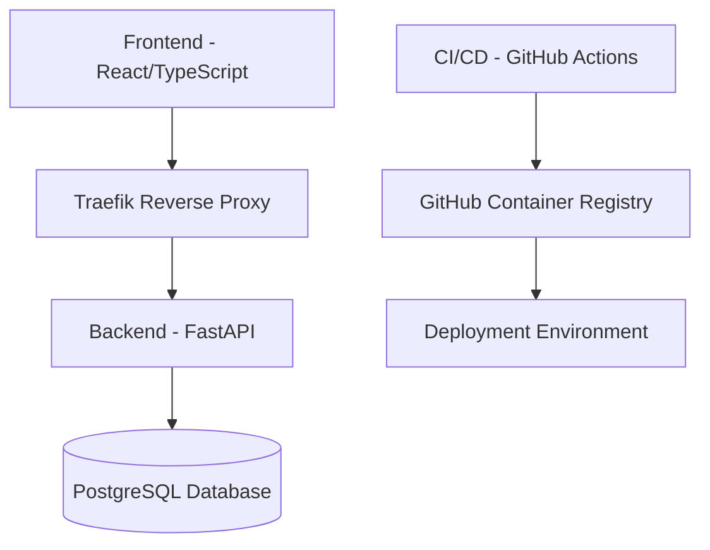
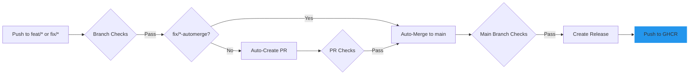

# 🚀 DevOps Demo Application

     

This repository contains a modern full-stack application with a FastAPI backend and React frontend, featuring a comprehensive CI/CD pipeline for AWS deployment.

## 📋 Table of Contents

- [Architecture Overview](#-architecture-overview)
- [Development Environment Setup](#-development-environment-setup)
- [Makefile for Local Setup](#-makefile-for-local-setup)
- [Docker-based Development](#-docker-based-development)
- [Local Development](#-local-development)
- [Development Workflow](#-development-workflow)
- [CI/CD Pipeline](#-cicd-pipeline)
- [Documentation](#-documentation)
- [Environment Configuration](#-environment-configuration)
- [Testing](#-testing)
- [Troubleshooting](#-troubleshooting)

## 🏗️ Architecture Overview



- **Frontend**: React, TypeScript, TanStack Query, Chakra UI
- **Backend**: FastAPI, SQLModel, Pydantic
- **Database**: PostgreSQL
- **Infrastructure**: Docker, Traefik, GitHub Container Registry (GHCR)
- **CI/CD**: GitHub Actions
- **Build Tools**: Bun, TurboRepo, Biome

## 🛠️ Development Environment Setup

### Prerequisites

- [Docker](https://www.docker.com/) and Docker Compose
- [Python](https://www.python.org/) (3.11+)
- [uv](https://github.com/astral-sh/uv/) for Python package management
- [Git](https://git-scm.com/)
- [Bun](https://bun.sh/) for faster frontend builds
- [TurboRepo](https://turbo.build/) for monorepo management and build caching

### Initial Setup

1. **Clone the repository**

```bash
git clone https://github.com/yourusername/fastAPI-project-app.git
cd fastAPI-project-app
```

2. **Use the Makefile for setup**

```bash
# Setup the project (create .env, install dependencies)
make setup
```

Or manually:

```bash
# Generate a secure .env file from .env.example
make env
# Or manually: cp .env.example .env
# Edit .env with your preferred settings
```

3. **Install git hooks with pre-commit**

```bash
pip install pre-commit
pre-commit install --hook-type pre-commit --hook-type commit-msg --hook-type pre-push
```

This will set up git hooks to automatically format code, run linting checks, and ensure code quality on commit.

## 🔧 Makefile for Local Setup

The project includes a Makefile to simplify common development tasks:

```bash
# Show available commands
make help

# Setup the project (create .env, install dependencies)
make setup

# Start Docker containers with Bun, TurboRepo, and UV
make docker-up

# Initialize the database (create tables and first superuser)
make init-db

# Stop Docker containers
make docker-down

# Restart Docker containers
make docker-restart

# Run all tests
make test

# Create a new feature branch
make create-feature-branch name=branch-name

# Create a new fix branch
make create-fix-branch name=branch-name
```

## 🗄️ Database Initialization

The application automatically initializes the database when the backend container starts, creating all necessary tables and the first superuser account. This process is handled by the prestart script that runs before the FastAPI application starts.

If you need to manually initialize or reset the database, you can use:

```bash
# Initialize the database (create tables and first superuser)
make init-db
```

### Default Login Credentials

After initialization, you can log in with:
- **Email**: admin@example.com
- **Password**: The value of `FIRST_SUPERUSER_PASSWORD` in your `.env` file

## 🚀 Fast Build System (Bun + TurboRepo + Traefik + UV)

This project uses a modern, high-performance build system:

- **Bun**: For faster JavaScript/TypeScript execution and package management
- **TurboRepo**: For efficient monorepo management and build caching
- **Traefik**: For efficient reverse proxy and routing
- **UV**: For optimized Python package management

All build operations are handled through Docker and the Makefile for consistency.

## 🐳 Docker-based Development

The easiest way to get started is using our optimized Docker Compose setup, which configures all services including the frontend, backend, and database.

### Starting the Environment

```bash
# Using Makefile (recommended)
make docker-up

# Or directly with Docker Compose
docker compose up -d
```

### Accessing Services

- **Frontend**: http://dashboard.localhost
- **Backend API**: http://api.localhost
- **API Documentation**: http://api.localhost/docs
- **API ReDoc**: http://api.localhost/redoc
- **API OpenAPI Schema**: http://api.localhost/openapi.json
- **Traefik Dashboard**: http://localhost:8080

### Default Login Credentials

After initialization, you can log in with:
- **Email**: admin@example.com
- **Password**: The value of `FIRST_SUPERUSER_PASSWORD` in your `.env` file

### Viewing Logs

```bash
# All services
docker compose logs -f

# Specific service
docker compose logs -f backend
```

### Rebuilding Services

```bash
# After code changes
docker compose up -d --build

# Restart all services
make docker-restart
```

## 💻 Development Workflow

All development is done using Docker and the provided Makefile commands for consistency across environments.

### Using TurboRepo for Faster Builds

This project uses TurboRepo for monorepo management and build caching, significantly improving build times. All operations are performed using Docker and Bun for maximum performance:

```bash
# Using Makefile (recommended)
make docker-up  # Starts all services with Bun for faster builds

# Run TurboRepo commands through Makefile
make turbo-build  # Builds all workspaces with caching (ensures containers are running)
make turbo-test   # Runs tests across all workspaces
make turbo-lint   # Runs linting across all workspaces
make turbo-clean  # Cleans TurboRepo cache

# Run backend-specific tasks through Makefile
make turbo-backend-test  # Run backend tests
make turbo-backend-lint  # Run backend linting
```

TurboRepo caches build outputs between runs, making incremental builds much faster. The cache is persisted in Docker volumes for consistent performance across restarts.

## 🔄 Development Workflow

### Branch Strategy

1. **🌱 Feature Branches (`feat/* || fix/*`)**
   - Create for new features or bug fixes
   - Must pass pre-commit hooks before pushing
   - On push triggers:
     * Style checks (black, flake8, eslint, prettier)
     * Security checks (bandit, npm audit, pip-audit)
     * Linting & formatting
     * Unit tests
   - Requires PR review to merge to `dev`

2. **🔨 Development Branch (`dev`)**
   - Integration branch for feature development
   - On push triggers:
     * Minimal test suite (unit, linting, security)
     * Automatic staging deployment
   - PR to `main` triggers:
     * Full test suite (integration, e2e, API)
     * Security scans
     * Performance tests
     * Documentation updates
     * Changelog generation

3. **🚀 Main Branch (`main`)**
   - Production-ready code
   - Protected branch requiring PR approval
   - On push/PR merge:
     * Complete test suite
     * Security scans
     * Dependency checks
   - Release tags trigger production deployment

### Creating a Feature

```bash
git checkout dev
git pull
git checkout -b feat/your-feature-name
# Make changes
git commit -m "feat: your feature description"
# Create PR to dev branch
```

### Testing Workflows Locally

You can test GitHub Actions workflows locally using the provided script:

```bash
./scripts/test-workflow.sh feature-branch-checks.yml push
```

## 🔄 CI/CD Pipeline

Our CI/CD pipeline uses GitHub Actions for automation and GitHub Container Registry for image management. The actual deployment is handled by a separate infrastructure repository:



### GitHub Container Registry (GHCR) Configuration

We use GitHub Container Registry to store and manage our Docker images:

- **Image Repository**: `ghcr.io/datascientest-fastapi-project-group-25/fastapi-project-app`
- **Tagging Strategy**:
  - Feature branches: `ghcr.io/datascientest-fastapi-project-group-25/fastapi-project-app:feat-branch-name`
  - Fix branches: `ghcr.io/datascientest-fastapi-project-group-25/fastapi-project-app:fix-branch-name`
  - Main branch: `ghcr.io/datascientest-fastapi-project-group-25/fastapi-project-app:latest`
  - Versioned releases: `ghcr.io/datascientest-fastapi-project-group-25/fastapi-project-app:v1.2.3`

#### Authentication

The GitHub Actions workflows automatically authenticate with GHCR using the built-in `GITHUB_TOKEN` secret. For local development, you can authenticate using:

```bash
# Login to GHCR
echo $GITHUB_TOKEN | docker login ghcr.io -u USERNAME --password-stdin

# Pull an image
docker pull ghcr.io/datascientest-fastapi-project-group-25/fastapi-project-app:latest
```

## 📚 Documentation

All project documentation is organized in the `docs/` directory for better maintainability:

- **[Development Guide](./docs/development/guide.md)** - Setting up and running the application locally
- **[Deployment Guide](./docs/deployment/guide.md)** - Deploying using GitHub Actions and GitHub Container Registry
- **[GitHub Actions Workflows](./docs/workflows/github-actions.md)** - Overview and best practices for CI/CD workflows
- **[Git Hooks](./docs/git-hooks.md)** - Documentation for the pre-commit git hooks setup
- **[Release Notes](./docs/release-notes.md)** - Comprehensive changelog of all project changes

Component-specific documentation can be found in the respective directories:
- **[Backend Documentation](./backend/README.md)**
- **[Frontend Documentation](./frontend/README.md)**

For a complete overview of all documentation, see the [Documentation Index](./docs/README.md).

1. **Continuous Integration**
   - Automated testing
   - Code quality checks
   - Security scanning
   - Performance testing

2. **Continuous Deployment**
   - Staging environment (dev branch)
   - Production environment (main branch releases)
   - Deployment to target environments
   - Docker image management in GitHub Container Registry (GHCR)

## 🔐 Environment Configuration

The application uses environment variables for configuration. A sample `.env.example` file is provided as a template.

### Important Environment Variables

| Variable | Purpose | Example |
|----------|---------|--------|
| `DOMAIN` | Base domain for the application | `localhost` |
| `SECRET_KEY` | Used for JWT token generation | `your-secret-key` |
| `BACKEND_CORS_ORIGINS` | Configures CORS for the API | `["http://localhost"]` |
| `POSTGRES_USER` | Database username | `postgres` |
| `POSTGRES_PASSWORD` | Database password | `postgres` |
| `POSTGRES_DB` | Database name | `app` |

### Subdomain-based Routing

For local development, the application uses subdomain-based routing:

- `api.localhost` - Backend API
- `dashboard.localhost` - Frontend dashboard
- `adminer.localhost` - Database administration

To enable this on your local machine, add these entries to your hosts file:

```
127.0.0.1 api.localhost
127.0.0.1 dashboard.localhost
127.0.0.1 adminer.localhost
```

## 🧪 Testing

### Backend Tests

```bash
cd backend
source .venv/bin/activate
pytest
```

### Frontend Tests

```bash
cd frontend
npm test
```

### End-to-End Tests

```bash
cd frontend
npm run test:e2e
```

## 🔍 Troubleshooting

### Common Issues

1. **Docker Compose Network Issues**
   - Restart Docker: `docker compose down && docker compose up -d`

2. **Database Connection Failures**
   - Check database credentials in `.env`
   - Ensure PostgreSQL service is running: `docker compose ps`

3. **Frontend API Connection Issues**
   - Verify CORS settings in `.env`
   - Check API URL configuration in frontend

4. **Login Issues**
   - If you can't log in, ensure the database is properly initialized: `make init-db`
   - Default login credentials are:
     - Email: admin@example.com
     - Password: Check your `.env` file for FIRST_SUPERUSER_PASSWORD
   - If login still fails, check the backend logs: `docker compose logs backend`
   - For a complete database reset: `docker compose down -v && make docker-up && make init-db`

3. **Security Best Practices**:
   - Never commit `.env` files to version control
   - Use strong, unique passwords for all credentials
   - Rotate secrets regularly in production environments
   - Use different credentials for development, staging, and production

### Subdomain-Based Routing

The application uses a subdomain-based routing approach for different services:

1. **Local Development**:
   - API: http://api.localhost
   - Frontend: http://dashboard.localhost
   - API Docs: http://api.localhost/docs
   - API ReDoc: http://api.localhost/redoc
   - Adminer: http://db.localhost

2. **Configuration**:
   - The routing is handled by Traefik reverse proxy
   - Local development uses Traefik with appropriate hosts file entries
   - CORS is configured in Traefik to allow cross-subdomain communication

3. **Startup Information**:

   When you run `docker compose up`, you'll see:
   - Application URLs for all services
   - Default login credentials
   - Database initialization status
   - Health status of all components

   If you want to run the application in detached mode, use `docker compose up -d`.
   - than you can see the startup information in the logs `docker compose logs app-status`

4. **Adding a Host Entry (Local Development)**:
   ```bash
   # Add to /etc/hosts
   127.0.0.1 api.localhost dashboard.localhost db.localhost
   ```

## Contributing

1. Fork the repository
2. Create your feature branch (`git checkout -b feat/amazing-feature`)
3. Commit your changes (`git commit -m 'feat: add amazing feature'`)
4. Push to the branch (`git push origin feat/amazing-feature`)
5. Open a Pull Request to the `dev` branch
